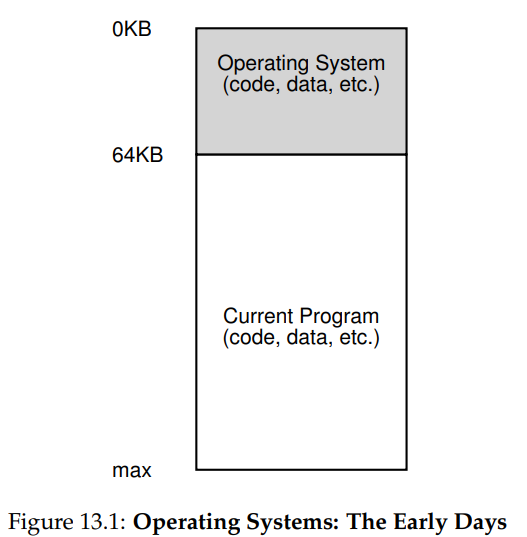
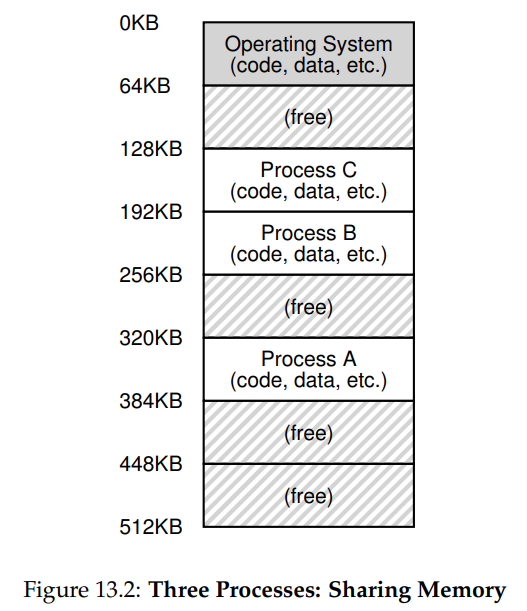
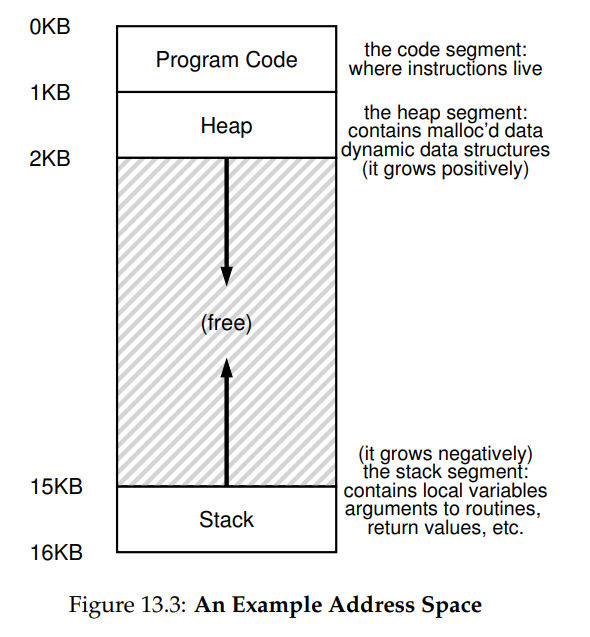

## The Abstraction: Address Spaces

### Early Systems

Early OS was a set of routines (a library,really) that sat in memory (starting at physical address 0) and there would be one running program (a process) that currently sat in physical memory (starting at physical address 64k) and used the rest of memory.

----

### Mutilprogramming and Time Sharing

> Because machines were expensive, people began to **share machines** more effectively. Thus the era of **multiprogramming** was born , in which multiple processes were ready to run at a given time, and the OS would switch between them.
>
> Doing so increased the effective **utilization** of the CPU. Such increases in **efficiency** were particularly important in those days where each machine cost hundreds of thousands or even millions of dollars.

* **Basic Way of Time Sharing:**

  > Run one process for a short while, giving it full access to all memory (Figure 13.1), then stop it, save **all of its state to some kind of disk (including all of physical memory), load some other process’s state**, run it for a while, and thus implement some kind of crude sharing of the machine.

* **Improvement**

  > The basic idea is too slow,particularly as memory grows.While saving and restoring register-level state (the PC, general-purpose registers, etc.) is relatively fast, saving the entire contents of memory to disk is brutally non-performant.

  So We **leave process in memory** while switching between them.

  

* **Issues:**

  > In particular, allowing multiple programs to reside concurrently in memory makes **protection** an important issue; **you don’t want a process to be able to read, or worse, write some other process’s memory**.

---

### The Address Space

**Address Spaces** is one abstraction to the running programs view of memory in the system.

* **Code**
* **stack**
* **heap**

$$
(process)\space virtual\space address ---physical\space address\space (OS\space and\space hardware)
$$

---

### Goals

* **transparency:** 

  > The OS should implement virtual memory in a way that is **invisible to the running program**. Thus, the program shouldn’t be aware of the fact that memory is virtualized; rather, the program behaves as if **it has its own private physical memory**. Behind the scenes, the OS (and hardware) does all the work to **multiplex memory** among many different jobs, and hence implements the illusion.

* **efficiency:**

  > In implementing time-efficient virtualization, the OS will have to **rely on hardware support**, including hardware features such as TLBs (which we will learn about in due course).

* **protection**

  > Protection thus enables us to deliver the property of isolation among processes; each process should be running in its own **isolated** cocoon, safe from the ravages of other faulty or even malicious processes.

