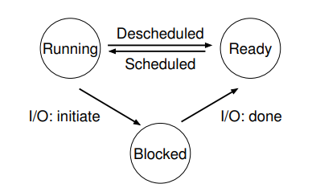

## Process

### Intro

**Process** ,*simply a* `running program`.

**Program** ,*it just sits there on the disk, a bunch of instructions (and maybe some static data), waiting to spring into action.*


**How To Provide The illusion of Many CPUS?** ====>> **virtualizing the CPU**

**How To Implement Virtualization Of The CPU ?** ====>>

* *low-level machinery* -----`mechanisms`
  * **time-sharing**
  * **context switch**
  * space sharing
* *high-level intelligence* -----`policies`
  * **sheduling policy**

-------

### The Abstraction: A Process

**machine state** ------ : *what a program can read or update when it is running*

* **memory**---------*Instructions lie in memory; the data that the running program reads and writes sits in memory as well. Thus the memory that the process can address (called its address space) is part of the process.*

* **registers**--------

  * *many instructions explicitly read or update registers*

  * special registers: `program counter(instruction pointer)`、`stack pointer`、`frame pointer`

* **I/O information**-------*include a list of the files the process currently has open*

------

### Process API

* **Create**
* **Destroy**
* **Wait**
* **Miscellaneous Control**
* **Status**

-----

### Process Creation:A Little More Detail

**How does the OS get a program up and running?**

1. **load**------*read those bytes from disk and place them in memory*

   `ps`

   *In early (or simple) operating systems, the loading process is done eagerly, i.e., all at once before running the program; modern OSes perform the process lazily.*------how to achieve this will discuss later.

2. **prepare for process**

   * **allocate memory for process**-----*both run-time stack and dynamic heap*

   * **relate to file descriptors**

3. **create process and transfer control to the newly-create process**

-----

### Process States

**Three State**:

* `Running`:*In the running state, a process is running on a processor. This means it is executing instructions.*
* `Ready`:*In the ready state, a process is ready to run but for some reason the OS has chosen not to run it at this given moment.*
* `Blocked`: *In the blocked state, a process has performed some kind of operation that makes it not ready to run until some other event takes place. A common example: when a process initiates an I/O request to a disk, it becomes blocked and thus some other process can use the processor.*

**Sheduled and descheduled** ===>

*Being moved from ready to running means the process has been scheduled;*

*Being moved from running to ready means the process has been descheduled.*



---

### Data Structures

**process list**------*keep some kind of process list of all process that are ready and some additional information to track which process is currently running.*

**xv6 Proc Structure**

```c
// the registers xv6 will save and restore
// to stop and subsequently restart a process
struct context {
    int eip;
    int esp;
    int ebx;
    int ecx;
    int edx;
    int esi;
    int edi;
    int ebp;
};
// the different states a process can be in
enum proc_state { UNUSED, EMBRYO, SLEEPING,
					RUNNABLE, RUNNING, ZOMBIE };
// the information xv6 tracks about each process
// including its register context and state
struct proc {
    char *mem; // Start of process memory
    uint sz; // Size of process memory
    char *kstack; // Bottom of kernel stack
    // for this process
    enum proc_state state; // Process state
    int pid; // Process ID
    struct proc *parent; // Parent process
    void *chan; // If !zero, sleeping on chan
    int killed; // If !zero, has been killed
    struct file *ofile[NOFILE]; // Open files
    struct inode *cwd; // Current directory
    struct context context; // Switch here to run process
    struct trapframe *tf; // Trap frame for the
    // current interrupt
};
```

___

### summary

* *The* `process` *is the major OS abstraction of a running program. At any point in time, the process can be described by its state: the contents of memory in its address space, the contents of CPU registers (including the* `program counter` *and* `stack pointer`, *among others), and information about I/O (such as open files which can be read or written).*
* *The* `process API` *consists of calls programs can make related to processes. Typically, this includes creation, destruction, and other useful calls.*
* *Processes exist in one of many different* `process states`, *including running, ready to run, and blocked. Different events (e.g., getting scheduled or descheduled, or waiting for an I/O to complete) transition a process from one of these states to the other.* 
* *A* `process list` *contains information about all processes in the system. Each entry is found in what is sometimes called a* `process control block (PCB)`, *which is really just a structure that contains information about a specific process.*

