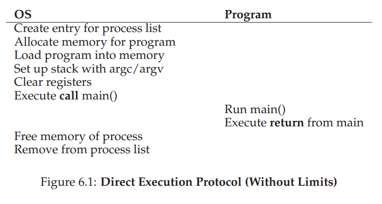
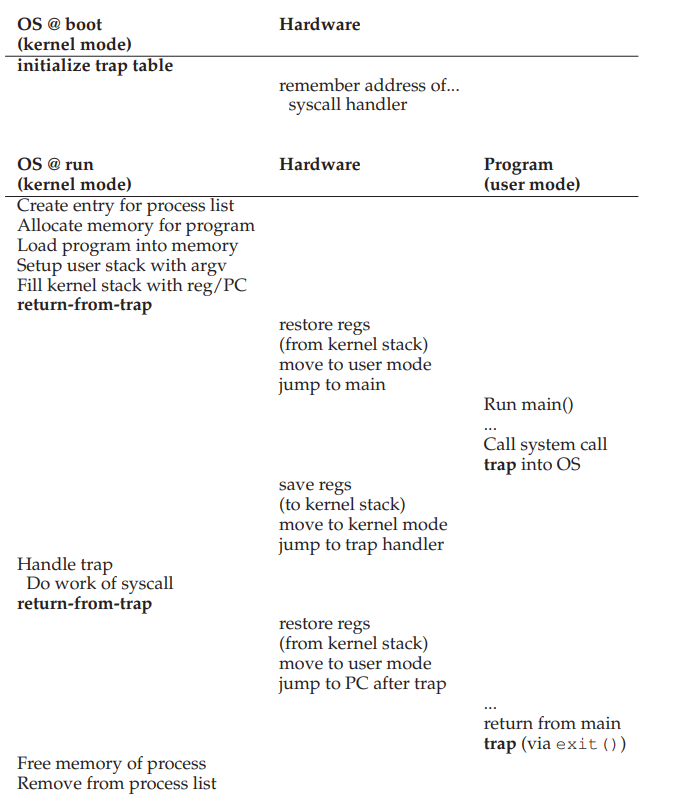

## Mechanism:Limited Direct Execution

### Intro

**How does the operating system  seems to make many jobs running at the same time**

====> 

*run one process for a little while, then run another one, and so forth.*

**Two Challenges**

* `performance`
* `control`

----

### Basic Technique: Limited Direct Execution

**Direct Execution**

*  *just run the program directly on the CPU*
* *creates a process entry*
* *allocates some memory*
* *loads the program code into memory*
* *locates its entry point (i.e., the main() routine or something similar*

____



___

Model above leads to 2 questions:

* *if we just run a program, how can the OS make sure the program doesn’t do anything that we don’t want it to do, while still running it efficiently?*
* *when we are running a process, how does the operating system stop it from running and switch to another process, thus implementing the time sharing we require to virtualize the CPU*

---

### Problem#1: Restricted Operations

*A process must be able to **perform I/O and some other restricted operations**, but **without giving the process complete control over the system**. How can the OS and hardware work together to do so?*

* *One approach would **simply be to let any process do whatever it wants** in terms of I/O and other related operations. However, doing so would prevent the construction of many kinds of systems that are desirable. For example, if we wish to build a file system that **checks permissions before granting access to a file**, we can’t simply let any user process issue I/Os to the disk; if we did, a process could simply read or write the entire disk and thus all protections would be lost.*

* `user mode` *and* `kernel mode`

  *via **system call** to change these two mode.*

  > *The hardware assists the OS by providing different modes of execution. In **user mode**, applications **do not have full access to hardware resources**. In **kernel mode**, the OS has **access to the full resources of the machine**. Special instructions to **trap** into the kernel and **return-from-trap** back to user-mode programs are also provided, as well as instructions that allow the OS to tell the hardware where the trap table resides in memory.*

=====>> **how does the trap know which code to run inside the OS?**

*the calling process **can’t specify an address to jump to**,Thus the kernel must carefully **control what code executes upon a trap**.*

=====>>

*The kernel does so by **setting up a trap table at boot time**. When the machine **boots up**, it does so in privileged (kernel) mode, and thus is **free to configure machine hardware** as need be.*

___



___

*The OS informs the hardware of the locations of these **trap handlers**, usually with some kind of special instruction. Once the **hardware is informed**, it remembers the location of these handlers until the machine is **next rebooted***


**user mode** ====> **kernel mode**

via `system-call number` instead of `address` directly

----

### Problem#2: Switching Between Process

**How to achieve a switch between process**

* *there is clearly no way for the OS to take an action if it is not running on the CPU.*
* *How can the operating system regain control of the CPU so that it can switch between processes?*


#### A Cooperative Approach: Wait For System Calls

*in a cooperative scheduling system, the OS regains control of the CPU by **waiting for a system call** or an **illegal operation of some kind** to take place.*

#### A Non-Cooperative Approach: The OS Takes Control

> **Without some additional help from the hardware**, it turns out the OS can’t do much at all when a process refuses to make system calls (or mistakes) and thus return control to the OS. In fact, in the **cooperative approach**, your only recourse when a process gets stuck in an infinite loop is to resort to the age-old solution to all problems in computer systems: **reboot the machine**.

*Great Solution*-------***Timer interrupt***

* *a pre-configured interrupt handler at boot time*
* *during the boot sequence, the OS must start the timer*

* *can be turn off in a privileged mode*

#### Saving and Restoring Context

* `scheduler`------*Now that the OS has regained control, w a decision has to be made: **whether to continue running the currently-running process, or switch to a d0ifferent one**.*

* `context scheduler`-------*A context switch is conceptually simple: all the OS has to do is **save a few register values for the currently-executing process **(onto its kernel stack, for example) and restore a few for the soon-to-be-executing process (from its kernel stack).*

  ----

  

----

```x86
# void swtch(struct context **old, struct context *new);
# Save current register context in old
# and then load register context from new.
.globl swtch
swtch:
# Save old registers
movl 4(%esp), %eax # put old ptr into eax
popl 0(%eax) # save the old IP
movl %ecx, 12(%eax)
movl %edx, 16(%eax)
movl %esi, 20(%eax)
movl %edi, 24(%eax)
movl %ebp, 28(%eax)

# Load new registers
movl 4(%esp), %eax # put new ptr into eax
movl 28(%eax), %ebp # restore other registers
movl 24(%eax), %edi
movl 20(%eax), %esi
movl 16(%eax), %edx
movl 12(%eax), %ecx
movl 8(%eax), %ebx
movl 4(%eax), %esp # stack is switched here
pushl 0(%eax) # return addr put in place
ret # finally return into new ctxt
```

---

#### Worried About Concurrency?

***What happens when you’re handling one interrupt and another one happens? Doesn’t that get hard to handle in the kernel?***

**One simple thing an OS might do is disable interrupts during interrupt processing; doing so ensures that when one interrupt is being handled, no other one will be delivered to the CPU.**

----

#### Summary: baby proofing

* *The CPU should support at least two modes of execution: a restricted **user mode** and a privileged (non-restricted) **kernel mode***
* *Typical user applications run in user mode, and use a **system call** to trap into the kernel to request operating system services.*
* *The trap instruction saves register state carefully, changes the hardware status to kernel mode, and jumps into the OS to a pre-specified destination: **the trap table**.*
* *When the OS finishes servicing a system call, it returns to the user program via another **specialreturn-from-trap** instruction, which reduces privilege and returns control to the instruction after the trap that jumped into the OS.*
* *The trap tables must be set up by the OS at boot time, and make sure that they cannot be readily modified by user programs. All of this is part of the **limited direct execution** protocol which runs programs efficiently but without loss of OS control.*
* *Once a program is running, the OS must use hardware mechanisms to ensure the user program does not run forever, namely the **timer interrupt**. This approach is a **non-cooperative approach** to CPU scheduling.*
* *Sometimes the OS, during a timer interrupt or system call, might wish to switch from running the current process to a different one, a low-level technique known as a **context switch**.*

