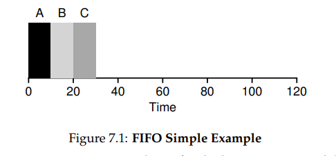
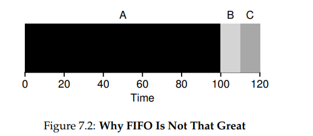
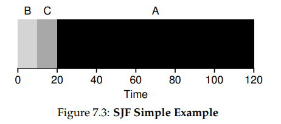
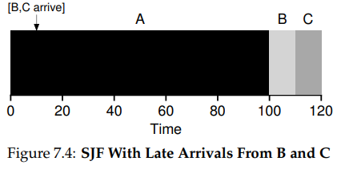
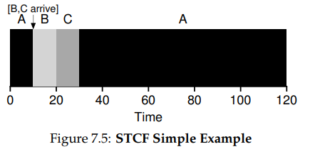
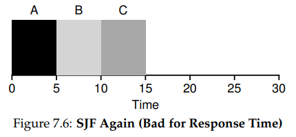
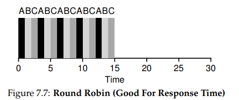
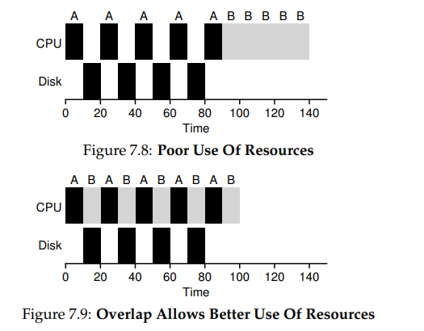

## Scheduling:Introduction

### Intro

*By now low-level **mechanisms** of running processes(e.g. context switching) should be clear;*

*Then it should be high-level **policies **(or **disciplines**) that an OS scheduler employs.*

----

### Workload Assumptions

*First we make some **simplifying assumptions** about the process running in the system,sometimes called the **workload**.*

 `process` **<<<>>>**`job`

* **5 assumptions**
  1. *Each job runs for the same amount of time.*
  2. *All jobs arrive at the same time.*
  3. *Once started, each job runs to completion.*
  4. *All jobs only use the CPU (i.e., they perform no I/O)*.
  5. *The run-time of each job is known.*

*Next we will **relax these assumptions** one by one.*

----

### Scheduling Metrics

* **turnaround time** : *The turnaround time of a job is defined as the time at which the job completes minus the time at which the job arrived in the system.*

  ​														*Tturnaround = Tcompletion − Tarrival*

* **response time** : *See next.*

---

### First In,First Out(FIFO)

*The most basic algorithm we can implement is known as **First In, First Out (FIFO)** scheduling or sometimes **First Come, First Served (FCFS)**.*

* *Imagine assumption 2, suppose three jobs, A, B, C, arrive at the same time, with just a hair between each other.*

​	   *The average turnaround time is (10+20+30)/3=20.*

* *Now let's **relax assumption 1**,suppose A requires 100 time.*

​		*Then the average turnaround time is (100+110+120)/3=110.*

----

### Shortest Job First(SJF)

* *We can easily think about the best way to decrease average turnaround time is make the shortest job do first.*

  

  *Then the average turnaround time turns to (10+20+120)/3=50.*

* *Now let's **relax assumption 2**,suppose A arrives first then B,C comes.*

  

  *The average turnaround time turns to (100+(110-10)+(120-10))/3=103.33.*

---

### Shortest Time-to-Completion First(STCF)

* *To address this concern, we need to **relax assumption 3**. We can make use of context switch.*

  

  *With the turnaround time comes to ((120-0)+(20-10)+(30-10))/3=50.*

---

### A New Metric: Response Time

* *We define response time as the time from when the **job arrives** in a system to **the first time it is scheduled** . More formally:*

  ​																*Tresponse = Tfirstrun − Tarrival* 

* *For SJF, the response time will be like:*

  

  *Not great for the response time, especially when the user interact with terminal.*

___

### Round Robin

* **Round Robin** :*The basic idea is simple: instead of running jobs to completion,**RR** runs a job for a **time slice** (sometimes called a **scheduling quantum**) and then switches to the next job in the run queue. It repeatedly does so until the jobs are finished. For this reason, RR is sometimes called **time-slicing**.*

  

* *Something need to pay attention here is that **the slice shorter** ,**better for the response time**,but probably **the time for context switch** will **dominate overall performance**. So just choose a proper time slice.* 
* *The Round Robin is bad for turnaround time, each policy **can't better turnaround time and response time at the same time**.*

___

### Incorporating I/O

*Now we relax **assumption 4**, suppose A need 5 parts of works and between each part there is one I/O request, B need no I/O request.*

*And thus we see how a scheduler might incorporate I/O. By treating each CPU burst as a job, the scheduler makes sure processes that are “interactive” get run frequently. While those interactive jobs are performing I/O, other CPU-intensive jobs run, thus better utilizing the processor.*

---

### No More Oracle

*Now we have only the 5th assumption to solve-----"How does OS knows the future" ,which will discuss next chapters.*

---

### Summary

*We have introduced the basic ideas behind scheduling and developed **two families of approaches**. The first runs the shortest job remaining and thus **optimizes turnaround time**; the second alternates between all jobs and thus **optimizes response time**. **Both are bad where the other is good**, alas, an inherent trade-off common in systems. We have also seen **how we might incorporate I/O into the picture**, but have **still not solved the problem of the fundamental inability of the OS to see into the future**. Shortly, we will see how to overcome this problem, by **building a scheduler that uses the recent past to predict the future**. This scheduler is known as the **multi-level feedback queue**, and it is the topic of the next chapter.*

