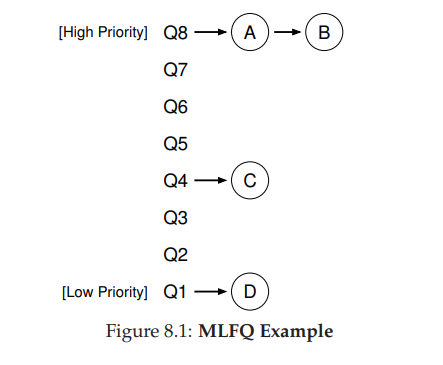
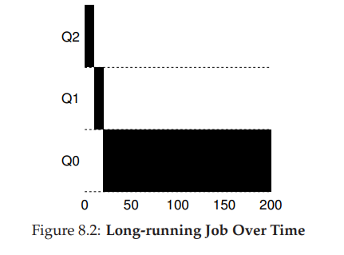
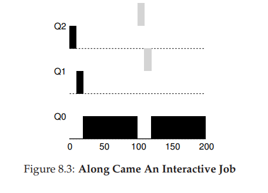
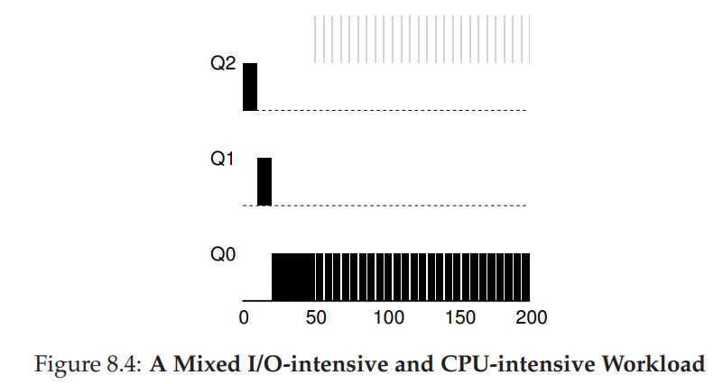
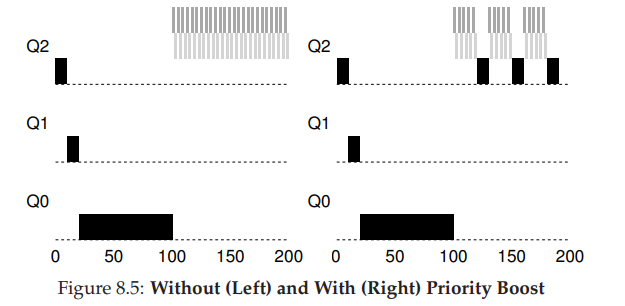
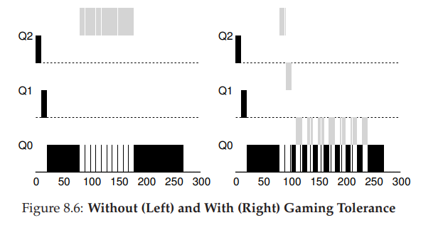
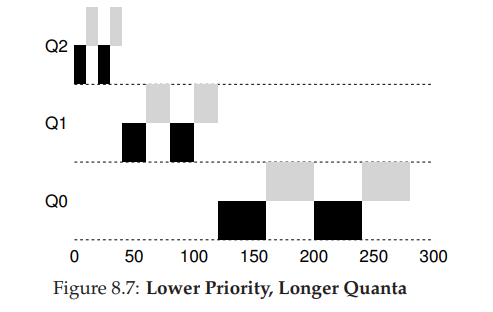

## Scheduling: The Multi-Level Feedback Queue(MLFQ)

### Intro

*The fundamental problem MLFQ tries to address is two-fold.*

* *First, it would like to **optimize turnaround time**, which, as we saw in the previous note, is done by **running shorter jobs first**;*

  *Unfortunately, the OS doesn’t generally know **how long a job will run for**, exactly the knowledge that algorithms like SJF (or STCF) require.*

* *Second, MLFQ would like to make a system feel responsive to interactive users,and thus **minimize response time**;*

  *However, algorithms like Round Robin **reduce response time but are terrible for turnaround time**.*

**Then we get these questions:**

> *Given that we in general **do not know anything about a process**, how can we build a scheduler to achieve these goals? How can the scheduler **learn**, as the system runs, **the characteristics of the jobs** it is running, and thus make better scheduling decisions?*

---

### MLFQ:Basic Rules

**Touch two basic rules for MLFQ**:

1. **Rule 1**: *If Priority(A) >Priority(B), A runs (B doesn't).*
2. **Rule 2**: *If Priority(A) =Priority(B), A & B runs in RR.*

**Then we get this question:**

>*In the figure, two jobs **(A and B) are at the highest priority level**, while job **C is in the middle** and Job **D is at the lowest priority**. Given our current knowledge of how MLFQ works, the scheduler would **just alternate time slices between A and B **because they are the highest priority jobs in the system; **poor jobs C and D would never even get to run **— an outrage!*

**Things are clear that we have to change the priority of each job over time.**

---

### Attempt #1: How to Change Priority

**Suppose**--*a mix of **interactive jobs that are short-running** (and may frequently relinquish the CPU), and some **longer-running “CPU-bound” jobs that need a lot of CPU time but where response time isn’t important.***

**Add three rules for this adjustment**:

1. **Rule 3:** *When a job enters the system, it is placed at the highest priority (the topmost queue).*
2. **Rule 4a:** *If a job uses up an entire time slice while running, its priority is reduced(i.e., it moves down one queue).*
3. **Rule 4b:** *If a job gives up the CPU before the time slice is up, it stays at the same priority level.*

**Here We discuss several examples about the rules set above.**

* **Example 1: A Single Long-Running Job**

  

* **Example 2: Along Came A Short Job**

  

* **Example 3: What About I/O?**

  

> **Problem With Our Current MLFQ**
>
> * *First, there is the problem of **starvation**: if there are **“too many” interactive jobs** in the system, **they will combine to consume all CPU time**, and **thus long-running jobs will never receive any CPU time (they starve)**. We’d like to make some progress on these jobs even in this scenario.*
> * *Second, a smart user could **rewrite their program to game the scheduler**: **before the time slice is over, issue an I/O operation (to some file you don’t care about) and thus relinquish the CPU**; doing so allows you to remain in the same queue, and thus gain a higher percentage of CPU time. **When done right (e.g., by running for 99% of a time slice before relinquishing the CPU), a job could nearly monopolize the CPU.***
> * *Finally, When a program **change from CPU-bound to a phase of interactivity**, such a job would be out of luck and not be **treated like the other interactive jobs** in the system currently.*

-----

### Attempt #2 : The Priority Boost

**Add one rule to avoid the problem of starvation:**

* **Rule 5:** *After some time period S, move all the jobs in the system to the topmost queue.*

**This new rule solves two problem at once.**

* **Starvation**

  

* **change from CPU-bound to a phase of interactivity**

> *Of course, **the addition of the time period S leads to the obvious question**: **what should S be set to**? John Ousterhout, a well-regarded systems researcher [O11], used to call such values in systems **voo-doo constants**, because they seemed to **require some form of black magic to set them correctly**. Unfortunately, S has that flavor. **If it is set too high, long-running jobs could starve; too low, and interactive jobs may not get a proper share of the CPU**.*

----

### Attempt #3: Better Accounting

*We now have one more problem to solve: **how to prevent gaming of our scheduler**?*

*The solution here is to **perform better accounting of CPU time at each level of the MLFQ**.*

**Then We rewrite Rule 4a and Rule 4b:**

* **Rule 4**: *Once a job uses up its time allotment at a given level (regardless of how many times it has given up the CPU), its priority is reduced (i.e., it moves down one queue)*.

>*With such protections in place, **regardless of the I/O behavior of the process, it slowly moves down the queues, and thus cannot gain an unfair share of the CPU**.*

----

### Tuning MLFQ And Other Issues

*A few other issues arise with MLFQ scheduling. One big question is **how to parameterize such a scheduler.**For example, **how many queues should there be? How big should the time slice be per queue? How often should priority be boosted in order to avoid starvation and account for changes in behavior?***

* *Varying time-slice length across different queues.*

  

**Two implementation：**

* **The Solaris MLFQ implementation **— the **Time-Sharing scheduling class, or TS **— is particularly easy to configure; 

  **It provides a set of tables that determine exactly how the priority of a process is altered throughout its lifetime, how long each time slice is, and how often to boost the priority of a job; an administrator can muck with this table in order to make the scheduler behave in different ways.**  

  **Default values** *for the table are 60 queues, with slowly increasing time-slice lengths from 20 milliseconds (highest priority) to a few hundred milliseconds (lowest), and priorities boosted around every 1 second or so.*

* Other MLFQ schedulers don’t use a table or the exact rules described in this chapter; rather they adjust priorities using **mathematical formulae.**

----

### MLFQ: Summary

**Five Rules:**

1. **Rule 1**: If Priority(A) > Priority(B), A runs (B doesn’t). 
2. **Rule 2**: If Priority(A) = Priority(B), A & B run in round-robin fashion using the time slice (quantum length) of the given queue. 
3. **Rule 3**: When a job enters the system, it is placed at the highest priority (the topmost queue). 
4. **Rule 4**: Once a job uses up its time allotment at a given level (regardless of how many times it has given up the CPU), its priority is reduced (i.e., it moves down one queue). 
5. **Rule 5**: After some time period S, move all the jobs in the system to the topmost queue.

>MLFQ is interesting for the following reason: **instead of demanding a priori knowledge of the nature of a job, it observes the execution of a job and prioritizes it accordingly**. In this way, it manages to **achieve the best of both worlds**: it can deliver excellent **overall performance (similar to SJF/STCF) for short-running interactive jobs**, and is **fair and makes progress for long-running CPU-intensive workloads**.