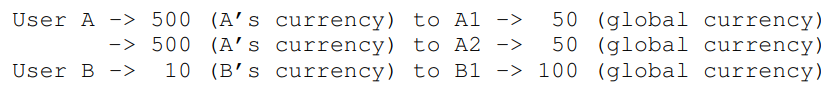
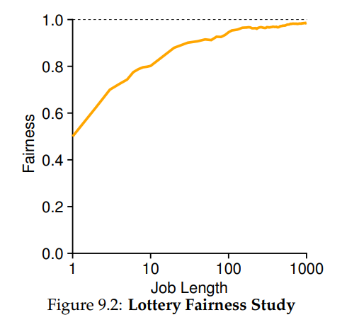
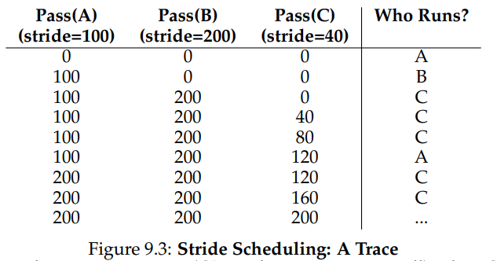
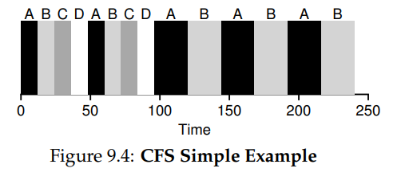
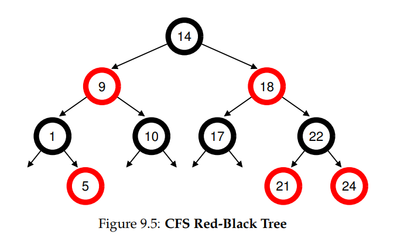

## Scheduling: Proportional Share

### Intro

**Proportional-share** *is based around a simple concept: instead of optimizing for turnaround or response time, a scheduler might instead try to **guarantee that each job obtain a certain percentage of CPU time**.*

**Lottery scheduling:** *every so often, **hold a lottery to determine which process should get to run next**; processes that should run more often should be given more chances to win the lottery.*

>How To Share The CPU Proportionally?

### Basic Concept: Tickets Represent Your Share

Assump 2 process A and B:

A holds 75 tickets while B has 25.Then the scheduler using random numbers to decide which one should run every cycle.

For instance:

|  63  |  85  |  70  |  39  |  76  |  17  |  29  |  41  |  36  |  39  |  10  |  99  |  68  |  83  |  63  |  62  |  43  |  0   |  49  |  12  |
| :--: | :--: | :--: | :--: | :--: | :--: | :--: | :--: | :--: | :--: | :--: | :--: | :--: | :--: | :--: | :--: | :--: | :--: | :--: | :--: |
|  A   |  B   |  A   |  A   |  B   |  A   |  A   |  A   |  A   |  A   |  A   |  B   |  A   |  B   |  A   |  A   |  A   |  A   |  A   |  A   |

---

### Ticket Mechanisms

#### ticket currency

Suppose user A is running 2 jobs ,A1 and A2 and gives them each 500 tickets; user B is running 1 job and gives it 10 tickets.

A and B both hold 100 tickets.



#### ticket transfer

*With transfers, a process can **temporarily hand off its tickets to another process**.*

*This ability is especially useful in a **client/server setting**, where **a client process sends a message to a server asking it to do some work on the client’s behalf**. To **speed up the work**, **the client can pass the tickets to the server and thus try to maximize the performance of the server while the server is handling the client’s request**. When finished, the server then **transfers the tickets back to the client and all is as before**.*

#### ticket inflation

*With inflation, a process can **temporarily raise or lower the number of tickets it owns**.*

*It can be used in an environment **where a group of processor trust one another**;int such case one process can **boost its ticket value as a way to reflect that need to the system without communication with other process**.*

*Or one greedy process could give itself a vast number of tickets and take over the machine.*

---

### Implementation

```c
//counter: used to track if we've found the winner yet
int counter=0;
//winner: use some call to a random number generator to get a value,
//        between 0 and the total # of tickets
int winner = getrandom(0,totaltickets);

//current: use this to walk through the list of jobs
node_t* current=head;
while (current){
    counter=counter+current->tickets;
    if (counter > winner) break;//found the winner
    current=current->next;
}
//'current' is the winner: schedule it.. 
```

---

### An Example

How lottery achieves fairness:

Assume 2 jobs own the same number of tickets and same run time , R.

Define one fairness matric , F simply the first job completes divided by the time that the second job completes.For example ,if R=10,and the first job finished at time 10(and the second 20), F=10/20=0.5.

A perfectly fair scheduler would achieve F=1.



---

### How To Assign Tickets?

*One approach is to **assume that the users know best**; in such a case, **each user is handed some number of tickets**, and a user can **allocate tickets to any jobs they run as desired**. However, this solution is a nonsolution: it really doesn’t tell you what to do. Thus, given a set of jobs, **the “ticket-assignment problem” remains open**.*

---

### Stride Scheduling

**Stride Scheduling:** A deterministic fair-share scheduler.

>Each job in the system has a **stride, which is inverse in proportion to the number of tickets it has**. In our example above, with jobs A, B, and C, with 100, 50, and 250 tickets, respectively, we can compute the stride of each **by dividing some large number(e.g. 10000) by the number of tickets each process has been assigned**.
>
>We call this value the stride of each process; every time a process runs, we will **increment a counter for it (called its pass value)** by its stride to track its global progress.
>
>The basic idea is simple: at any given time, **pick the process to run that has the lowest pass value so far**; when you run a process, increment its pass counter by its stride. 



**Given the precision of stride scheduling,why use lottery scheduling at all?**

*lottery scheduling has one nice property that stride scheduling does not: **no global state**. Imagine **a new job enters in the middle of our stride scheduling example above; what should its pass value be?** Should it be **set to 0**? If so, it will **monopolize the CPU**. With **lottery scheduling**, there is no global state per process; we **simply add a new process with whatever tickets it has, update the single global variable to track how many total tickets we have, and go from there**. In this way, lottery makes it much easier to incorporate new processes in a sensible manner.*

---

### The Linux Completely Fair Scheduler(CFS)

#### Basic Operation

**virtual runtime :** As each process runs, it accumulates *vruntime*.

*In the most basic case, each process’s vruntime increases at the same rate, in proportion with physical (real) time. When a scheduling decision occurs, CFS will pick the process with the lowest vruntime to run next.*

--> **When to stop and run the next one?**

* **sched_latency:** CFS uses this value to determine **how long one process should run before considering a switch** (effectively determining its time slice but in a dynamic fashion).

  CFS **divides this value by the number (n) of processes running on the CPU to determine the time slice for a process**, and thus ensures that over this period of time, CFS will be completely fair.

  

* **min_granularity:** If there are two many process running, it will lead to too small of a time slice thus too many context switches. To avoid this ,CFS never set the time slice of a process to less than this value.

#### Weighting(Niceness)

*CFS also enables **controls over process priority**, enabling users or administrators to **give some processes a higher share of the CPU**.*

**nice:** CFS maps the nice value of each process to a weight ,as shown here

```c
static const int prio_to_weight[40] = {
/* -20 */ 88761, 71755, 56483, 46273, 36291,
/* -15 */ 29154, 23254, 18705, 14949, 11916,
/* -10 */ 9548, 7620, 6100, 4904, 3906,
/* -5 */ 3121, 2501, 1991, 1586, 1277,
/* 0 */ 1024, 820, 655, 526, 423,
/* 5 */ 335, 272, 215, 172, 137,
/* 10 */ 110, 87, 70, 56, 45,
/* 15 */ 36, 29, 23, 18, 15,
};
```

*These weights allow us to compute the effective time slice of each process (as we did before), but now **accounting for their priority differences**. The formula used to do so is as follows, assuming n processes:*
$$
time\_slice_k = {weight_k\over \sum_{i=0}^{n-1}weight_i } * sche\_latency
$$
*update vruntime , weight<sub>0</sub> is 1024 as the table above:*
$$
vruntime_i=vruntime_i + {weight_0 \over weight_i} * runtime_i
$$

#### Using RB-Trees

*CFS does not keep all process in this structure; rather, **only running (or runnable) processes** are kept therein. If a process goes to sleep (say, waiting on an I/O to complete, or for a network packet to arrive), **it is removed from the tree and kept track of elsewhere**.*



#### Dealing with I/O and sleeping Processes

>Imagine two processes, A and B, one of which (A) runs continuously, and the other (B) which has gone to sleep for a long period of time (say, 10 seconds). When B wakes up, its vruntime will be 10 seconds behind A’s, and thus (if we’re not careful), B will now monopolize the CPU for the next 10 seconds while it catches up, effectively starving A.

*CFS handles this case **by altering the vruntime of a job when it wakes up**. Specifically, CFS sets the vruntime of that job to the **minimum value found in the tree** (remember, the tree only contains running jobs).*

---

### Summary

> No scheduler is a panacea, and fair-share schedulers have their fair share of problems. One issue is that such approaches do not particularly mesh well with I/O [AC97]; as mentioned above, jobs that perform I/O occasionally may not get their fair share of CPU. Another issue is that they leave open the hard problem of ticket or priority assignment, i.e., how do you know how many tickets your browser should be allocated, or to what nice value to set your text editor? Other general-purpose schedulers (such as the MLFQ we discussed previously, and other similar Linux schedulers) handle these issues automatically and thus may be more easily deployed. 
>
> The good news is that there are many domains in which these problems are not the dominant concern, and proportional-share schedulers are used to great effect. For example, in a virtualized data center (or cloud), where you might like to assign one-quarter of your CPU cycles to the Windows VM and the rest to your base Linux installation, proportional sharing can be simple and effective. The idea can also be extended to other resources; see Waldspurger [W02] for further details on how to proportionally share memory in VMWare’s ESX Server.

